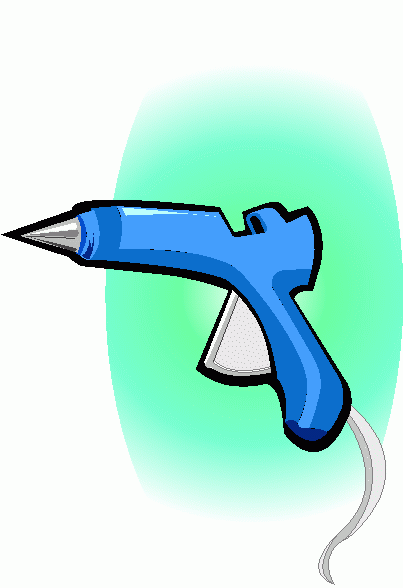
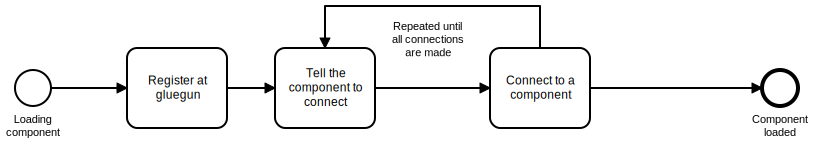

# gluegun



`gluegun` pieces together individual parts of inexor.

Imagine the `gluegun` having a conversation with other parts of `inexorgame` like this:

_Plugin:_
> Hey man, I would like to be part of Inexor, how does it work?

_gluegun:_
> Sure. Tell me how can I reach you out?

_Plugin:_
> You can find me under this address!

_gluegun:_
> Nice. You will need to meet some other fellows in order to get this up and running and then you're done.

In order to be able to understand each other one must built a _"plugin"_. 

## About plugins
A `plugin` has two items in it's receipt:

- a list of `SIGNAL`s that can be issued by this `plugin`
- the data that is sent over the wire when a specific `SIGNAL` is triggered

This way a `plugin` is able to interchange with other `plugins` across different languages, platforms and setups.

An example `plugin` would look like this:

```
namespace inexorgame.plugins;

/// Signals issued by this component
enum Signal : byte {
    JOKE
}

/// The root type for this plugin
table PluginMessage {
    signal:Signal;
    joke:string;
}

root_type PluginMessage;
```

Technically, we use [`flatbuffers`](https://google.github.io/flatbuffers/) and [`nanomsg`](https://nanomsg.org) to realize this pattern.

The above process can be visualized like this:



## Running gluegun

Running `gluegun` is quite easy, given that you have `go` and `flatc` installed:

- `cd ${GOPATH}/github.com/inexorgame/gluegun` (you should have cloned this repository here)
- `go get -u github.com/google/flatbuffers/go`
- `flatc gluegun.fbs --go -o ../../` (this will generate the files to `github.com/inexorgame/plugin`)
- `dep ensure`
- `go run gluegun.go`

## Building a component

We have illustrated how one can built `plugins` in different languages.

Please have a look at the [`plugins` folder](./plugins).

You will always need to include the [`gluegun.fbs`](./gluegun.fbs) schema in your respective language in order to be able to talk to `gluegun`
